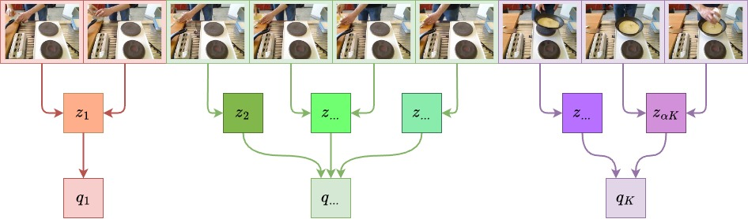
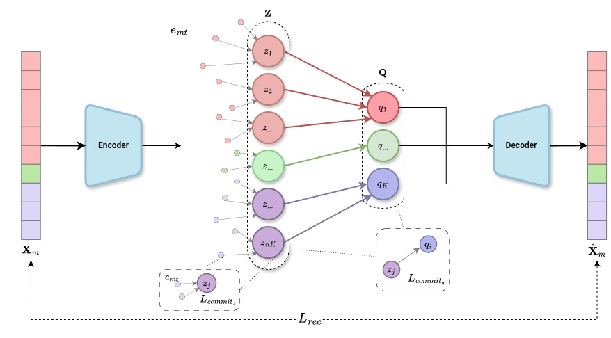
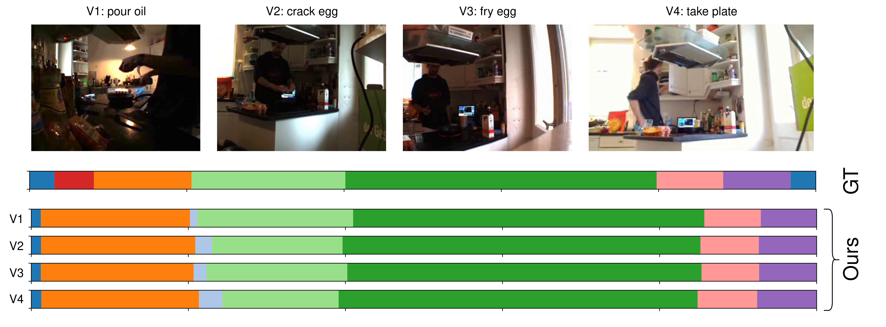

# [AAAI 2025] Hierarchical Vector Quantization for Unsupervised Action Segmentation
Official implementation of the paper "Hierarchical Vector Quantization for Unsupervised Action Segmentation"

Full implementation coming soon!

## Citation
If you find this code or our model useful, please cite our [paper](https://arxiv.org/abs/2412.17640):
```latex
@inproceedings{hvq2025spurio,
    author    = {Federico Spurio and Emad Bahrami and Gianpiero Francesca and Juergen Gall},
    title     = {Hierarchical Vector Quantization for Unsupervised Action Segmentation},
    booktitle = {AAAI Conference on Artificial Intelligence (AAAI)},
    year      = {2025}
}
```

## Overview

### Hierarchical Vector Quantization (HVQ) Architecture
**Hierarchical Vector Quantization (HVQ)** is an unsupervised action segmentation approach that exploits the natuaral compositionality of actions. By employing a hierarchical stack of vector quantization modules, it effectively achieves accurate segmentation.

Here is the overview of our proposed model:
<p align="center">

</p>

More in details, the pre-extracted features are processed through an Encoder, implemented as a two-stage MS-TCN. The resulting encodings are then progressively quantized using a sequence of vector quantization modules. Each module operates with a decreasing codebook size, gradually refining the representation until the desired number of action classes is achieved.
<p align="center">

</p>

### Jensen-Shannon Distance (JSD) Metric
**The Jensen-Shannon Distance (JSD)** is a metric for evaluating the bias in the predicted segment lengths.
For each video within the
same activity, we compute the histogram of the predicted
segment lengths, using a bin width of 20 frames. We then
compare this histogram with the corresponding ground-truth
histogram using the Jensen-Shannon Distance. These JSD
scores are averaged across all videos for each activity. Finally, we calculate a weighted average across all activity,
where the weights are the number of frames in each activity.
In particular:

$$
\begin{equation}
    \text{JSD} = \frac{\sum_{a \in A} F_a \cdot \frac{1}{|M_a|} \sum_{m \in M_a} \text{JSDist}(H_m^{\text{pred}}, H_m^{\text{gt}})}{\sum_{a \in A} F_a},
\end{equation}
$$

where $F_a{=}\sum_{m=1}^{M_a} T_m$ is the total number of frames and  $M_a$ is the set of all the videos for activity $a \in A$. JSDist is the Jensen-Shannon Distance:

$$
\begin{equation}
    \text{JSDist}(P, Q) = \sqrt{\frac{D_{\text{KL}}(P \parallel M) + D_{\text{KL}}(Q \parallel M)}{2}}
\end{equation}
$$

where $M{=}\frac{P+Q}{2}$ and $D_{\text{KL}}$ is the Kullback-Leibler divergence. 
The input of JSDist is normalized such that the sum of each histogram $H_m$ is one. 


## Datasets

### - Breakfast [[1]](#1)
The features and annotations of the Breakfast dataset can be downloaded from 
[link 1](https://mega.nz/#!O6wXlSTS!wcEoDT4Ctq5HRq_hV-aWeVF1_JB3cacQBQqOLjCIbc8) 
or 
[link 2](https://zenodo.org/record/3625992#.Xiv9jGhKhPY).

### - YouTube INRIA Instructional (YTI) [[2]](#2)
- [Features](https://drive.google.com/file/d/1HyF3_bwWgz1QNgzLvN4J66TJVsQTYFTa/view)
- [Annotations](https://drive.google.com/file/d/1ENgdHvwHj2vFwflVXosCkCVP9mfLL5lP/view)

### - IKEA ASM [[3]](#3)
Link for the features coming soon.

### Data Folder Structure
The `data` folder should be aranged in the following way:
```
data
|--breakfast
|  `--features
|     `--cereals
|        `--P03_cam01_P03_cereals.txt
|        `...
|     `--coffee
|     `--friedegg
|     `...
|  `--groundTruth
|     `--P03_cam01_P03_cereals
|     `...
|  `--mapping
|     `--mapping.txt
|
|--YTI
|  `...
|
|--IKEA
|  `...
```

## Installation
To create the [conda](https://docs.conda.io/en/latest/) environment run the following command:
```bash
conda env create --name hvq --file environment.yml
source activate hvq
```

Then run `pip install -e .` to avoid `Module name hvq not found` error.

## Run
After activating the `conda` environment, just run the training file for the chosen dataset, e.g. for breakfast:
```bash
python ./BF_utils/bf_train.py
```

### - Evaluation
To run and evaluate for every epoch with FIFA[[4]](#4) decoding and Hungarian Matching, set `opt.epochs=20` and `opt.vqt_epochs=1`. With the default combinations of parameter `opt.epochs=1, opt.vqt_epochs=20`, the model is trained and evaluated once at the end.

### - Classifier on top of HVQ predictions
To have more stable predictions between epochs, it is suggested to set `opt.use_cls=True`. With this option, a classifier is trained on the embeddings produced by the HVQ model using the pseudo-labels as ground-truth. Paper's results are produced **WITHOUT** this option.

## Acknowledgement
In our code we made use of the following repositories: [MS-TCN](https://github.com/yabufarha/ms-tcn), [CTE](https://github.com/annusha/unsup_temp_embed) and [VQ](https://github.com/lucidrains/vector-quantize-pytorch). We sincerely thank the authors for their codebases!

## Qualitative

Segmentation results for a sample from the Breakfast dataset (P22 friedegg). HVQ delivers highly
consistent results across multiple videos (V1, V2, V3, V4)
recorded from different cameras, but with the same ground
truth.

<p align="center">

</p>

## References
<a id="1">[1]</a> 
Kuehne, H.; Arslan, A.; and Serre T. The Language of
Actions: Recovering the Syntax and Semantics of GoalDirected Human Activities. In CVPR, 2014

<a id="2">[2]</a> 
Alayrac, J.-B.; Bojanowski, P.; Agrawal, N.; Sivic, J.;
Laptev, I.; and Lacoste-Julien, S. Unsupervised Learning From Narrated Instruction Videos. In CVPR, 2016

<a id="3">[3]</a> 
Ben-Shabat, Y.; Yu, X.; Saleh, F.; Campbell, D.; RodriguezOpazo, C.; Li, H.; and Gould, S. The ikea asm dataset: Understanding people assembling furniture through actions, objects and pose. In WACV, 2021

<a id="4">[4]</a>
Souri, Y.; Farha, Y.A.; Despinoy, F.; Francesca, G.; and Gall, J. Fifa: Fast inference approximation for action segmentation. In GCPR, 2021.

## License
<a rel="license" href="http://creativecommons.org/licenses/by-nc/4.0/"></a><br />This work is licensed under a <a rel="license" href="http://creativecommons.org/licenses/by-nc/4.0/">Creative Commons Attribution-NonCommercial 4.0 International License</a>.


